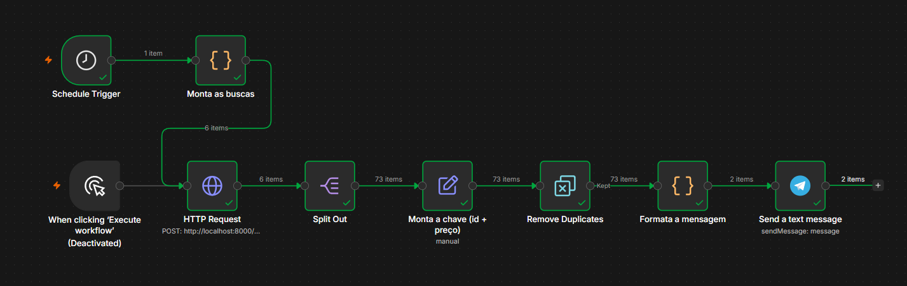

# n8n-imoveis

Pipeline em **n8n** que varre portais de imóveis de Curitiba, junta os anúncios,
descarta o que já foi visto e avisa apenas o que é novo ou baixou de preço.

O repositório tem duas metades:

| Pasta | O que é |
|---|---|
| `workflows/` | os workflows do n8n, exportados em JSON (o banco do n8n é binário e não é diffável) |
| `coletor/` | um **serviço** HTTP em FastAPI que busca as páginas e devolve anúncios normalizados |

> `coletor/` não é um script: é um serviço que fica de pé escutando numa porta, e o
> n8n conversa com ele por HTTP. Um script roda, faz e termina.

---

## O pipeline



| Nó | O que faz |
|---|---|
| **Schedule Trigger** | dispara todo dia às 11h |
| **Monta as buscas** | um item por (portal, bairro) — seis buscas |
| **HTTP Request** | `POST localhost:8000/coleta`; roda uma vez para cada item que chega |
| **Split Out** | quebra o array `itens` da resposta em **um item do n8n por anúncio** |
| **Monta a chave (id + preço)** | a chave de dedup |
| **Remove Duplicates** | descarta o que já apareceu em execuções anteriores |
| **Formata a mensagem** | junta os anúncios novos em uma ou duas mensagens |
| **Send a text message** | envia no Telegram |

O nó da chave existe **de propósito**, mesmo dando para calcular a expressão direto no
`Remove Duplicates`: assim a fórmula fica **visível no diagrama**, em vez de escondida num
parâmetro que só aparece se alguém abrir o nó certo. Quem for zerar o histórico de
duplicatas precisa saber qual é a chave.

O modelo mental importa aqui: **n8n é pipeline, não máquina de estado.** Não há estado
compartilhado, e um nó que recebe 20 itens roda 20 vezes. Por isso quatro portais são
**um nó e quatro itens**, não quatro nós — e por isso o `Split Out` é obrigatório antes da
dedup, senão ela compara *buscas inteiras* em vez de apartamentos.

---

## O alerta no Telegram

A credencial é do tipo **Telegram API** e vive no banco do próprio n8n, cifrada com
`N8N_ENCRYPTION_KEY` (em `~/.n8n/`). O token **não** fica no repositório: o `.env` da raiz
está no `.gitignore` e serve só como cópia de segurança, porque perder aquela chave torna
toda credencial guardada ilegível.

Quatro detalhes que decidem se a mensagem presta:

- **Agregar antes de enviar.** O nó do Telegram roda **uma vez por item de entrada**:
  mandar 80 anúncios direto vira **80 mensagens**. O nó de código anterior junta tudo num
  texto só
- **O Telegram corta em 4096 caracteres, contados DEPOIS de interpretar as tags.** O
  `href` de um link não entra na conta — só o rótulo visível. Imprimir a URL crua gastava
  ~120 caracteres por anúncio; pendurando o link no título, os mesmos **73 anúncios caíram
  de 5 mensagens para 2**. O corte é medido no texto já sem as tags, senão a conta erra
  para mais e quebra a mensagem cedo demais
- Ligue **Disable Web Page Preview** nas opções do nó, senão o Telegram monta um cartão de
  pré-visualização do primeiro link e empurra a lista para fora da tela
- **`Parse Mode: HTML`** nas opções do nó, senão as tags `<b>` chegam como texto literal

Os anúncios saem ordenados por **prioridade de bairro** e depois por preço.

### O que ainda não está resolvido

Quando não há nada novo, o agregador devolve `[]` e **nenhuma mensagem é enviada**. Isso
evita spam diário, mas cria um problema pior: **dia silencioso fica idêntico a pipeline
quebrado**. Um "nada novo hoje" de uma linha resolveria — ainda não implementado.

---

## ⚠️ Uso pessoal apenas

Este projeto foi escrito para **uma única pessoa procurar um imóvel para morar**.

- Volume baixo: uma varredura por dia, algumas dezenas de páginas
- Só dado público de anúncio, nada atrás de login
- **Não** rotaciona identidade, **não** usa proxy, **não** resolve captcha
- Não redistribui, não revende e não alimenta serviço de terceiros

Os portais pedem, nos termos de uso, que não se automatize o acesso. O que existe aqui
respeita o limite deles em volume e em ritmo, e para de insistir quando levam bloqueio.
**Não use isto para coleta em escala.** Se um portal passar a bloquear de forma mais
firme, a resposta certa é parar de usar aquele portal, não tentar disfarçar o acesso.

---

## Como rodar

```bash
cd coletor
uv venv
uv pip install -r requirements.txt
uv run uvicorn main:app --port 8000
```

O serviço precisa estar de pé **enquanto o workflow roda**. O agendamento do n8n
também só dispara enquanto o `npx n8n` estiver rodando: são dois processos vivos, não
um serviço de verdade. Diário para valer exige container com restart ou VPS.

### O endpoint

```
POST /coleta
{"portal": "vivareal", "bairro": "agua-verde", "url": "...", "paginas": 12}
```

Resposta:

```json
{"portal": "...", "bairro": "...", "paginas_lidas": 2, "total": 31,
 "lancamentos_ignorados": 5, "descartados_sem_preco": 0, "itens": [...]}
```

Os três contadores existem para separar falhas que se parecem:

- **`lancamentos_ignorados`** — prédio inteiro em lançamento, muitas unidades, sem preço
  único. Acontece toda rodada, é esperado
- **`descartados_sem_preco`** — anúncio comum sem preço legível. **Se subir, o portal
  mudou a estrutura.** Deve ficar em zero
- **`paginas_lidas`** — quantas páginas o portal realmente entregou

Portal sem extrator devolve **501** antes de abrir navegador. Falha de busca na primeira
página devolve **502**, nunca lista vazia: lista vazia no n8n fica verde com zero itens e
passa por "nada novo hoje".

---

## Paginação

Uma página traz **30 anúncios**. O `numberOfItems` do JSON-LD é **30 sempre** — é o
tamanho da página, não o tamanho do resultado. Sem paginar, cada rodada enxerga uma fatia
arbitrária: Água Verde sozinha tem 1.569 apartamentos, e a primeira página é **1,9%**
disso. Nesse cenário "não vi antes" não quer dizer "é novo", e o alerta nunca converge.

### Onde parar

**Não dá para parar em "veio menos de 30"**: a última página pode ter exatamente 30, e aí
o laço encerraria cedo ou pediria uma página a mais sem saber o que fazer com a resposta.

Três condições de parada, nesta ordem:

1. **Página vazia.** Página fora do intervalo devolve **200 sem o bloco `ItemList`** — não
   404. Verificado no VivaReal com `alto-da-gloria`, que tem 4 anúncios: a página 2 e a 3
   voltam 200 e vazias
2. **Nada inédito.** Se todos os ids já estavam na mão, o portal devolveu a primeira
   página de novo. Verificado no VivaReal; **o ZAP não foi verificado**
3. **Teto de 12 páginas**, que nenhuma busca real do perfil alcança

Falha depois da primeira página **não** derruba a coleta: entrega o que já leu.

### Filtrar na URL, não depois

Os filtros do portal funcionam e cortam muito mais do que filtrar no fim:

| Filtro (Água Verde) | Anúncios |
|---|---|
| sem filtro | 1.569 |
| `precoMaximo=950000` | 748 |
| + `quartos=2,3,4` | 226 |
| + `vagas=2,3,4` | 80 |
| + `areaMinima=100` | **31** |

Com o perfil inteiro, os seis bairros somam **80 apartamentos em 7 páginas** no VivaReal.

---

## Quanto tempo leva

Cada página abre e fecha um navegador, porque **o portal bloqueia a sessão**, não o ritmo:
a segunda busca no mesmo navegador volta 403 em meio segundo, com pausa de 3s ou de 8s.
Testado nos dois portais, com o mesmo resultado.

| | |
|---|---|
| Por página | ~2,5s de busca + 2s de navegador + 3s de pausa ≈ **8s** |
| Apartamentos, 6 bairros, VivaReal | 7 páginas ≈ **1 min** |
| Somando casas e o ZAP | ~28 páginas ≈ **2 a 3 min** |

A pausa é deliberada. Não a diminua para ganhar tempo.

---

## O que os dados têm, e o que não têm

Os anúncios saem do bloco `ItemList` do JSON-LD (schema.org) da própria página — mais
estável que seletor CSS. VivaReal e ZAP são do mesmo grupo e publicam a mesma estrutura,
então um extrator só atende os dois.

Vem estruturado e completo: `@id`, preço (`offers.price`), quartos, banheiros, área, rua.

Não vem, e por isso tem ressalva:

- **Bairro** não é campo. É **entrada da busca**, o que o deixa oficial por construção.
  Extrair não serviria: o `name` só traz o bairro em 9 de 30 anúncios, e o slug do ZAP usa
  nome comercial (`ecoville` onde o bairro oficial é Campina do Siqueira). O filtro do
  portal ainda vaza: numa busca por Água Verde, 1 dos 30 se declarou Portão — por isso
  fica gravado `bairro_declarado`, para conferência
- **Vagas** só aparece no texto do título: 27 de 30 no ZAP, 9 de 30 no VivaReal
- **Taxa de condomínio** existe em ~20 de 30, e é digitada pelo anunciante: aparecem
  valores como R$ 1. Ao filtrar, **mantenha os nulos** (`taxa is None or taxa <= 1000`),
  senão o filtro descarta *desconhecido* achando que descarta *caro*
- **Área** diverge entre fontes: `floorSize` disse 52 onde o slug dizia 53

---

## Limites conhecidos

- **ZAP e VivaReal são o mesmo estoque.** Numa busca comparada em Água Verde, **28 dos 30
  `@id` eram idênticos** entre os dois, e o ZAP **não trouxe nenhum anúncio exclusivo** (o
  VivaReal trouxe 2). Mesmo grupo, mesma base de anúncios. Consequência prática: a chave
  `id + preço` **já cruza** os dois portais, sem precisar de chave independente de portal.
  Os dois seguem ligados mesmo assim, por decisão de quem usa
- **Fonte de outra empresa é outra história.** O Chaves na Mão (usado pela skill
  `imoveis-curitiba`) emite `@id` próprio, então o mesmo apartamento vindo de lá **não**
  seria deduplicado contra estes. Aí sim seria preciso algo como `rua + área + preço`
- A chave inclui o preço **de propósito**: assim o anúncio reaparece quando o preço muda,
  que é o sinal que interessa a quem está comprando
- **`Set` em modo manual não acrescenta campo: ele substitui o item.** Com *Include Other
  Input Fields* desligado, tudo que vem depois recebe só os campos declarados ali, e o
  resto do anúncio some — **sem erro, com todos os nós verdes**. Foi assim que a primeira
  mensagem do Telegram chegou escrita `undefined · R$ NaN`: em JavaScript campo inexistente
  é `undefined`, `Number(undefined)` é `NaN`, e template literal converte os dois sem
  reclamar. Por isso o nó agregador **lança erro** quando chega item sem `preco`/`bairro`/
  `url`, listando as chaves que recebeu
- Expressão do n8n apontando para campo inexistente falha do mesmo jeito silencioso.
  Depois da primeira execução, confira a saída do `Split Out` antes de confiar na dedup
- **`$('Nome do Nó')` depende do nome como texto.** Renomeie o nó e a expressão passa a
  devolver `undefined`, verde. `$json` (o item que acabou de chegar) não tem esse risco
- O versionamento interno do n8n não é portátil: o JSON exportado é o artefato

## Licença de uso das ferramentas

O n8n é **fair-code** (Sustainable Use License), não open source: self-host livre para uso
próprio e interno, proibido revender como serviço.
